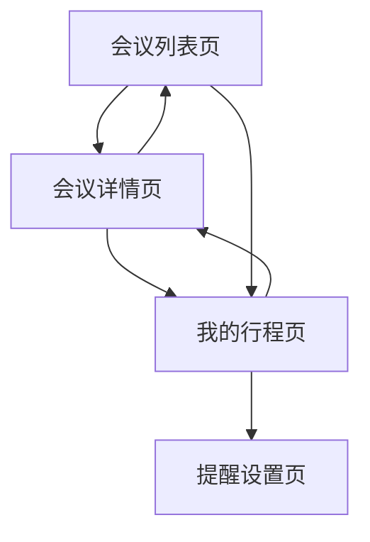

# 谷歌开发者大会会议预约管理系统 - 产品需求文档

## 1. 产品概述

本产品是一个专为谷歌开发者大会设计的移动端会议预约管理系统，帮助参会者高效管理个人行程安排。
- 解决开发者大会中会议时间冲突、行程规划困难的问题，为参会者提供清晰的会议信息展示和智能的冲突提醒功能。
- 目标用户是参加谷歌开发者大会的开发者、技术人员和相关从业者，帮助他们最大化参会价值。

## 2. 核心功能

### 2.1 功能模块

本系统包含以下核心页面：
1. **会议列表页**：会议信息展示、分类筛选、搜索功能
2. **会议详情页**：详细信息查看、预约操作、相关推荐
3. **我的行程页**：个人预约管理、时间冲突展示、行程优化建议
4. **提醒设置页**：提醒偏好配置、通知管理

### 2.2 页面详情

| 页面名称 | 模块名称 | 功能描述 |
|----------|----------|----------|
| 会议列表页 | 会议展示模块 | 展示所有会议信息，支持按时间、主题、难度等维度筛选和搜索 |
| 会议列表页 | 快速预约模块 | 提供一键预约功能，实时显示预约状态和冲突提示 |
| 会议详情页 | 详情展示模块 | 显示会议完整信息包括议题、讲师、时间、地点、难度等级 |
| 会议详情页 | 预约管理模块 | 处理预约操作，检测时间冲突，提供替代建议 |
| 我的行程页 | 行程概览模块 | 以时间轴形式展示个人预约的所有会议，突出显示冲突时段 |
| 我的行程页 | 冲突解决模块 | 智能分析时间冲突，提供优化建议和一键调整功能 |
| 提醒设置页 | 通知配置模块 | 设置会议开始前的提醒时间，支持多种提醒方式 |
| 提醒设置页 | 偏好管理模块 | 管理个人兴趣标签，优化会议推荐算法 |

## 3. 核心流程

**主要用户操作流程：**

用户首先进入会议列表页浏览所有可用会议，可通过筛选和搜索快速找到感兴趣的内容。点击会议卡片进入详情页查看完整信息，确认后进行预约操作。系统会实时检测时间冲突并给出提示。用户可在我的行程页查看所有预约，系统会以时间轴形式展示并突出标记冲突时段。在提醒设置页，用户可配置个性化的通知偏好。

## 4. 用户界面设计

### 4.1 设计风格

- **主色调**：Google品牌蓝 (#4285F4) 作为主色，辅以清新的浅灰 (#F8F9FA) 和警告橙 (#FF9800)
- **按钮样式**：圆角矩形按钮，主按钮采用渐变效果，次要按钮为线框样式
- **字体规范**：标题使用 18-24px 粗体，正文使用 14-16px 常规字重，注释信息使用 12px
- **布局风格**：卡片式设计，底部导航栏，支持手势滑动操作
- **图标风格**：采用 Material Design 图标系统，简洁现代

### 4.2 页面设计概览

| 页面名称 | 模块名称 | UI元素 |
|----------|----------|--------|
| 会议列表页 | 会议展示模块 | 卡片式布局，每张卡片包含会议标题、时间、地点、标签；顶部搜索栏和筛选按钮；底部无限滚动加载 |
| 会议列表页 | 快速预约模块 | 卡片右上角预约状态图标，点击弹出确认对话框；冲突时显示橙色警告标识 |
| 会议详情页 | 详情展示模块 | 大图背景头部，渐变遮罩显示标题；内容区域采用分段式布局，包含讲师头像、议程时间轴 |
| 会议详情页 | 预约管理模块 | 底部固定预约按钮，状态变化有动画效果；冲突提示采用模态弹窗，提供解决方案选项 |
| 我的行程页 | 行程概览模块 | 垂直时间轴设计，会议卡片按时间排序；冲突时段用红色连线标识，支持左滑删除操作 |
| 我的行程页 | 冲突解决模块 | 冲突会议用特殊样式高亮，点击展开优化建议；一键调整按钮采用醒目的绿色 |
| 提醒设置页 | 通知配置模块 | 列表式设置项，开关按钮和时间选择器；预览功能显示提醒效果 |
| 提醒设置页 | 偏好管理模块 | 标签云式兴趣选择，选中状态有动画反馈；推荐算法说明采用折叠式设计 |

### 4.3 响应式设计

产品采用移动端优先设计，针对 iOS 和 Android 平台优化触摸交互体验。支持横竖屏切换，关键操作区域符合拇指操作习惯，确保单手使用的便利性。