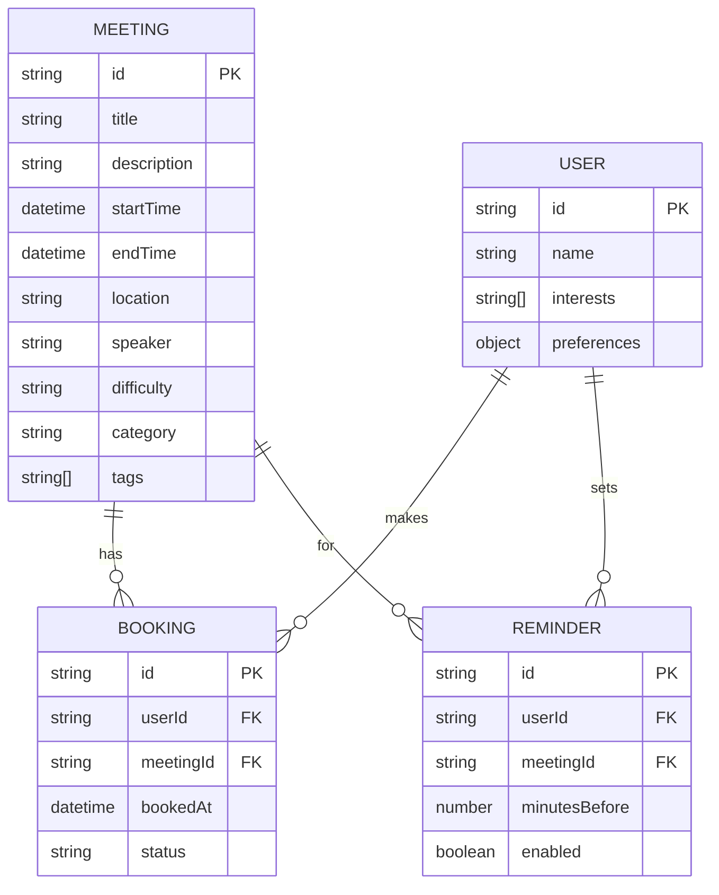

# 谷歌开发者大会会议预约管理系统 - 技术架构文档

## 1. 架构设计


## 2. 技术描述

* 前端：React\@18 + TypeScript + Vite + TailwindCSS + PWA

* 状态管理：Zustand

* 本地存储：IndexedDB + LocalStorage

* UI组件：Ant Design Mobile

* 构建工具：Vite

## 3. 路由定义

| 路由           | 用途                  |
| ------------ | ------------------- |
| /            | 会议列表页，展示所有会议信息和筛选功能 |
| /meeting/:id | 会议详情页，显示具体会议信息和预约操作 |
| /schedule    | 我的行程页，管理个人预约和冲突解决   |
| /settings    | 提醒设置页，配置通知偏好和个人兴趣   |

## 4. 数据模型

### 4.1 数据模型定义



### 4.2 数据定义语言

**会议表 (meetings)**

```typescript
interface Meeting {
  id: string;
  title: string;
  description: string;
  startTime: Date;
  endTime: Date;
  location: string;
  speaker: string;
  difficulty: 'beginner' | 'intermediate' | 'advanced';
  category: string;
  tags: string[];
  capacity: number;
  bookedCount: number;
}

// IndexedDB 存储结构
const meetingsStore = {
  name: 'meetings',
  keyPath: 'id',
  indexes: [
    { name: 'startTime', keyPath: 'startTime' },
    { name: 'category', keyPath: 'category' },
    { name: 'difficulty', keyPath: 'difficulty' }
  ]
};
```

**用户预约表 (bookings)**

```typescript
interface Booking {
  id: string;
  userId: string;
  meetingId: string;
  bookedAt: Date;
  status: 'confirmed' | 'cancelled' | 'conflict';
}

// IndexedDB 存储结构
const bookingsStore = {
  name: 'bookings',
  keyPath: 'id',
  indexes: [
    { name: 'userId', keyPath: 'userId' },
    { name: 'meetingId', keyPath: 'meetingId' },
    { name: 'status', keyPath: 'status' }
  ]
};
```

**提醒设置表 (reminders)**

```typescript
interface Reminder {
  id: string;
  userId: string;
  meetingId: string;
  minutesBefore: number;
  enabled: boolean;
  notificationType: 'browser' | 'sound' | 'vibration';
}

// IndexedDB 存储结构
const remindersStore = {
  name: 'reminders',
  keyPath: 'id',
  indexes: [
    { name: 'userId', keyPath: 'userId' },
    { name: 'meetingId', keyPath: 'meetingId' }
  ]
};
```

**用户偏好设置 (userPreferences)**

```typescript
interface UserPreferences {
  userId: string;
  interests: string[];
  defaultReminderTime: number;
  notificationEnabled: boolean;
  theme: 'light' | 'dark' | 'auto';
  language: 'zh-CN' | 'en-US';
}

// LocalStorage 存储
const userPreferencesKey = 'user_preferences';
```

**初始化数据**

```typescript
// 示例会议数据
const initialMeetings: Meeting[] = [
  {
    id: 'meeting-001',
    title: 'Android 开发新特性',
    description: '介绍 Android 14 的最新开发特性和最佳实践',
    startTime: new Date('2025-01-15T09:00:00'),
    endTime: new Date('2025-01-15T10:30:00'),
    location: '主会场 A',
    speaker: '张三',
    difficulty: 'intermediate',
    category: 'Android',
    tags: ['移动开发', 'Android', 'UI'],
    capacity: 200,
    bookedCount: 0
  },
  {
    id: 'meeting-002',
    title: 'Flutter 跨平台开发实战',
    description: '深入了解 Flutter 3.0 的新功能和性能优化技巧',
    startTime: new Date('2025-01-15T09:30:00'),
    endTime: new Date('2025-01-15T11:00:00'),
    location: '分会场 B',
    speaker: '李四',
    difficulty: 'advanced',
    category: 'Flutter',
    tags: ['跨平台', 'Flutter', '性能优化'],
    capacity: 150,
    bookedCount: 0
  }
];
```

